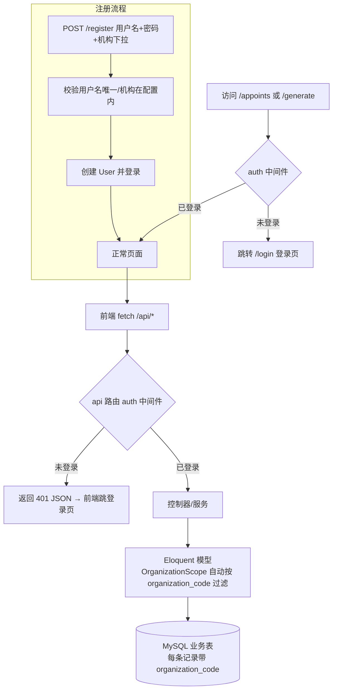

## 产品概述
为「好运爆棚」约课系统增加账号体系与机构级（多租户）数据隔离：同一个培训机构下的多个账号共享数据，不同机构之间数据完全隔离。机构通过后台配置文件维护（新增机构=配置文件加一条），不区分账号角色（同机构所有账号权限一致）。用户名+密码登录，开放注册，注册时从机构列表选择所属机构。存量业务数据清空重来。

## 核心功能
- **机构配置**：新增 `config/organizations.php` 维护机构列表（code + name），新增机构只需在配置中加一条
- **注册 / 登录 / 登出**：用户名 + 密码；注册时从机构下拉列表选择所属机构；开放注册，任何访问者可自行注册
- **机构级数据隔离**：聊天记录、约课记录、生成图片均按机构自动写入与过滤，同机构共享、跨机构不可见
- **页面与 API 鉴权**：未登录访问约课页/图片生成页自动跳转登录页；所有 `/api/*` 请求未登录返回 401
- **Excel 文件隔离**：生成的 Excel 文件名带机构前缀，下载时校验归属，防止跨机构访问文件
- **存量数据清理**：升级迁移中清空旧聊天/约课/图片数据（保留表结构），从新账号重新开始
- **前端适配**：登录/注册页（手机端优先），聊天页顶栏显示当前机构/用户名并提供登出入口，前端对 401 统一跳转登录页


## 技术栈
- 沿用现有：Laravel 12 + PHP 8.2 + MySQL + 豆包（火山方舟 Ark）
- 认证：Laravel 内置 Session 认证（不引入 Breeze/Jetstream 等脚手架，手写轻量 AuthController）
- 隔离：Eloquent 全局作用域（Global Scope）+ 模型 `creating` 事件自动填充
- 不引入任何新 Composer 依赖

## 实现方案
### 系统架构


### 关键设计
1. **机构配置**：`config/organizations.php` 返回 `['list' => [['code' => 'yy', 'name' => '游泳培训班'], ...]]`；注册校验 `organization_code` 必须存在于该列表。
2. **数据模型改造**（新迁移 `add_organization_to_tables`）：
   - `users`：新增 `username`（string, unique, not null）、`organization_code`（string, index）；`email` 改为 nullable（注册不再要求邮箱）
   - `messages` / `booking_records` / `generated_images`：各新增 `organization_code`（string, index）
   - 迁移 up() 中执行 `DB::table(...)->delete()` 清空三张业务表（存量清空重来，注释标明）
   - 对应模型 `$fillable` 增加 `username` / `organization_code`；User 模型无需自定义 `username()` 方法（Eloquent 默认按传入凭据字段查询）
3. **多租户隔离核心**（新增 `app/Models/Scopes/OrganizationScope.php`）：
   - `apply()`：`auth('web')->user()?->organization_code` 存在时追加 `where 表.organization_code = 当前机构`，未登录（CLI/测试/未认证）不过滤，保证 artisan 命令与测试可用
   - 在 `Message` / `BookingRecord` / `GeneratedImage` 三个模型的 `booted()` 中 `addGlobalScope(new OrganizationScope)` + `static::creating` 事件自动填充 `organization_code`——现有所有 `Model::create()` / 查询代码**零改动**即自动隔离
4. **认证**（新增 `AuthController`）：
   - `register`：校验 username 唯一、密码≥6位+确认、organization_code 在配置列表 → 创建用户（email 置 null）→ `Auth::login()` → 跳转 /appoints
   - `login`：`Auth::attempt(['username' => ..., 'password' => ...])` → 跳转 /appoints
   - `logout`：`Auth::logout()` + session invalidate + 跳转 /login
   - 视图：`login.blade.php` / `register.blade.php`，机构下拉数据由控制器传 `config('organizations.list')`
5. **路由与鉴权**：
   - `routes/web.php`：`/login`、`/register` 用 `guest` 中间件并命名 `login`（auth 中间件重定向目标）；`/appoints`、`/generate`、`POST /logout` 用 `auth` 中间件
   - `routes/api.php`：全部现有路由包进 `Route::middleware('auth')` 组
   - `bootstrap/app.php`：`$middleware->redirectGuestsTo(fn () => request()->is('api/*') || request()->expectsJson() ? response()->json(['error' => '未登录'], 401) : route('login'))`——保证 API 返回 JSON 401 而非 HTML 重定向
6. **前端适配**：
   - `chat.blade.php` / generate 页顶栏增加机构名 + 用户名 + 登出按钮（`POST /logout` 表单）
   - `public/js/chat.js`：封装 fetch 统一处理 401 → `location.href = '/login'`（在 `.then` 中检查 `res.status === 401`）
7. **Excel 文件隔离**：`ExcelService::generate()` 生成文件名加机构前缀（如 `{code}_booking_YYYYMMDD...xlsx`）；`ExcelController::download()` 校验文件名以当前机构 code 开头，否则 404，防止跨机构下载
8. **测试**（`tests/Feature/AuthOrganizationTest.php`）：注册/登录/登出流程；A 机构建约课 B 机构不可见、同机构可见；Excel 文件名隔离校验。参考现有 `tests/Feature/BookingQueryTest.php` 结构（RefreshDatabase）

### 性能与可靠性
- 全局作用域为 `organization_code` 等值过滤，配合迁移新增索引，单机构数据量小（场馆日常排课），无性能瓶颈
- 所有业务写入/读取路径（聊天、约课、图片、Excel 数据源）统一走 Eloquent 模型，隔离规则单一来源，不会漏
- 未登录上下文（CLI、tinker）不强制过滤，避免影响 artisan 命令；线上入口均有 auth 中间件兜底
- 注册/登录失败返回明确中文错误提示；API 未认证返回 401，前端统一跳转

### 目录结构
```
app/
├── Http/Controllers/
│   └── AuthController.php        # [NEW] 注册/登录/登出（showLogin/showRegister/register/login/logout）
├── Models/
│   ├── User.php                  # [MODIFY] fillable 增加 username/organization_code
│   ├── Message.php               # [MODIFY] fillable 增加 organization_code + booted 注册全局作用域/creating 填充
│   ├── BookingRecord.php         # [MODIFY] 同上
│   └── GeneratedImage.php        # [MODIFY] 同上
└── Models/Scopes/
    └── OrganizationScope.php     # [NEW] 全局作用域：按当前登录用户机构过滤
config/
└── organizations.php             # [NEW] 机构列表配置（新增机构=加一条）
database/migrations/
└── 2026_08_25_000001_add_organization_to_tables.php  # [NEW] users/业务表加字段+清空存量
resources/views/
├── login.blade.php               # [NEW] 手机端登录页
└── register.blade.php            # [NEW] 手机端注册页（机构下拉）
routes/
├── web.php                       # [MODIFY] 登录/注册/登出路由 + 页面加 auth
└── api.php                       # [MODIFY] 全部 API 包进 auth 中间件
bootstrap/
└── app.php                       # [MODIFY] redirectGuestsTo 闭包（API 返回 401 JSON）
public/
├── css/chat.css                  # [MODIFY] 顶栏用户区样式 + 登录/注册页样式（或新增 auth.css）
└── js/chat.js                    # [MODIFY] fetch 401 统一跳转登录页
tests/Feature/
└── AuthOrganizationTest.php      # [NEW] 注册/登录/隔离/Excel 隔离测试
README.md                         # [MODIFY] 补充账号体系说明与部署步骤
```

### 关键代码结构
```php
// app/Models/Scopes/OrganizationScope.php —— 机构级隔离核心
namespace App\Models\Scopes;

use Illuminate\Database\Eloquent\Builder;
use Illuminate\Database\Eloquent\Model;
use Illuminate\Database\Eloquent\Scope;

class OrganizationScope implements Scope
{
    public function apply(Builder $builder, Model $model): void
    {
        $code = auth('web')->user()?->organization_code;

        if ($code) {
            $builder->where($model->getTable().'.organization_code', $code);
        }
    }
}
```

```php
// 业务模型统一接入（Message / BookingRecord / GeneratedImage 三个模型各加）
protected static function booted(): void
{
    static::addGlobalScope(new OrganizationScope);

    static::creating(function (Model $model) {
        $code = auth('web')->user()?->organization_code;

        if ($code) {
            $model->organization_code = $code;
        }
    });
}
```

```php
// config/organizations.php —— 机构配置（新增机构=加一条）
return [
    'list' => [
        ['code' => 'demo', 'name' => '示例机构'],
    ],
];
```

## 执行注意事项
- 迁移会**清空**三张业务表数据（用户已确认存量清空重来），执行前注意备份
- `users.email` 改为 nullable 后，注册不填邮箱；password_reset_tokens 表未启用不受影响
- 改造后所有未登录访问都会被拦，联调时先注册/登录再测业务；测试用 RefreshDatabase 不受影响
- 不改变现有 API 请求字段与前端业务交互（仅新增登录态 + 401 处理）
- 本机无 PHP 环境，交付后需在装有 PHP 的环境执行 `php artisan migrate` 与 `php artisan test`


## 设计风格
登录/注册页沿用现有手机端聊天界面（chat.css）的轻快风格，与「好运爆棚」品牌一致。主题色使用现有 #4C6EF5 蓝色系。页面采用全屏浅色背景 + 居中圆角卡片布局：顶部品牌区（🍀 徽标 + 站点名），中部表单卡片（输入框聚焦时描边高亮、主按钮渐变蓝、错误提示红色小字），底部为注册/登录互相跳转链接。登录页保持极简（用户名 + 密码两个输入项 + 主按钮）；注册页在登录基础上增加确认密码与机构下拉选择（机构名来自后台配置）。页面底部留安全边距适配手机刘海屏。聊天页顶栏右侧增加「机构名 · 用户名」标签与登出按钮，登出按钮为浅色圆角小按钮，不破坏现有聊天界面布局。

## Agent Extensions
### SubAgent
- **code-explorer**
  - Purpose: 探索 ExcelService 生成/命名逻辑、Message/BookingRecord/GeneratedImage 全部调用点（ChatController/BookingController/GenerateController/ExcelController），确认全局作用域隔离的注入点与 Excel 文件名改造位置
  - Expected outcome: 完整调用点清单，确保加全局作用域后所有读写路径自动隔离、Excel 命名与下载校验改造无遗漏
### Skill
- **lsp-code-analysis**
  - Purpose: 语义分析验证 OrganizationScope 加入后对 BookingService 各查询方法（checkConflict/checkCoachConflict/locateTarget 等）与 Message::create 写入路径的影响，确认无绕过隔离的查询
  - Expected outcome: 确认隔离规则覆盖全部业务查询入口，新增代码命名与现有风格一致
