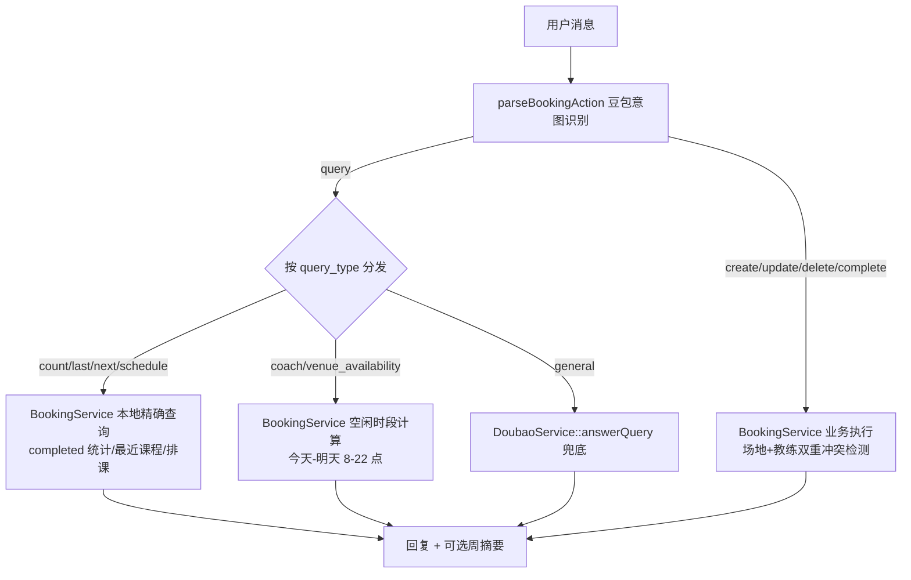

## 产品概述
聊天式约课助手需要根据用户消息内容精确分析用户需求，将消息归类为约课、调整、取消、标记完成、查询等动作，其中查询类问题从"豆包自由回答"升级为"本地精确计算 + 豆包兜底"，并补充教练维度的时间冲突校验。

## 核心功能
- **意图分类**：约课（create）/ 调整（update）/ 取消（delete）/ 上完课修改状态（complete）/ 查询（query）/ 其他（other）
- **查询子类型细分**：
  - 上了几节课（仅统计 status=completed 的记录）
  - 上一次课 / 下一次课分别是什么时候
  - 某学员/教练的排课（什么时候上课、有哪些课）
  - 教练今天/明天有没有空（同一教练同一时间只能带一节课）
  - 场地今天/明天有哪些空闲时段
  - 其他开放式问题（兜底交给豆包回答）
- **教练冲突检测**：约课与改期时同时校验场地冲突和教练冲突，冲突回复区分原因
- **空闲查询范围**：默认仅查今天和明天（最近 1-2 天）


## 技术栈
- 沿用现有：Laravel 12 + PHP 8.2 + MySQL + 豆包（火山方舟 Ark）
- 不引入新依赖，仍使用 Carbon、Eloquent

## 实现方案
以"意图识别增强 + 本地精确查询 + 教练冲突校验"三条线改造，查询类结果由 PHP 本地计算保证准确性，豆包仅负责意图/参数抽取和开放式问答兜底。

### 系统架构


### 关键设计
1. **意图识别增强**（DoubaoService::parseBookingAction）：在 system prompt 中为 query 意图增加 `query_type` 字段（count/last/next/schedule/coach_availability/venue_availability/general）及 `date_from`/`date_to`/`question` 字段；示例中补充"上了几节课""教练明天有空吗""上次课什么时候"等识别规则。视觉截图识别路径同步生效。
2. **本地精确查询**（BookingService 新增方法）：统计、最近课程、排课、空闲时段全部用 Eloquent 计算，避免豆包对 JSON 统计不准。
3. **教练冲突检测**（BookingService）：新增 `checkCoachConflict()`；`create()` 指定场地时双重校验、自动分配场地时需同时满足"场地空闲 + 教练空闲"；`update()` 在改动时间/教练/场地时双重校验。冲突消息区分"场地冲突"与"教练冲突"。
4. **控制器分发**（ChatController）：query 分支按 `query_type` 走本地查询并组装自然语言回复，缺参（如未指定教练/学员）时引导用户补充；general 及未知类型 fallback 到 `answerQuery()`。create/update/delete/complete 的 Excel 再生成逻辑保持不变。

### 性能与可靠性
- 所有查询均为带索引条件的单表 Eloquent 查询，数据量为场馆日常排课（每天约几十条），无性能瓶颈；空闲时段计算按天×营业小时（2 天×14 时段×4 场地）最多百余次内存判断，开销可忽略。
- 豆包解析失败/JSON 不合法时维持现有异常兜底路径（返回友好提示）。
- 冲突检测沿用现有"状态非 cancelled + 时间段重叠"查询模式，新增教练维度后保持与场地维度一致的时间重叠语义。

### 目录结构
```
app/
├── Services/
│   ├── BookingService.php        # [MODIFY] 新增 countCompletedLessons/lastLesson/nextLesson/schedule/coachAvailability/venueAvailability/checkCoachConflict；改造 create/update 双重冲突校验
│   └── DoubaoService.php         # [MODIFY] parseBookingAction prompt 增加 query_type 子类型与查询参数抽取规则
├── Http/Controllers/
│   └── ChatController.php        # [MODIFY] query 分支改为按 query_type 本地分发（新增 handleQuery 私有方法），general 兜底 answerQuery
└── Models/
    └── BookingRecord.php         # [MODIFY] 新增 query_type 常量（BOOKING_QUERY_*），便于类型安全与统一引用
tests/
├── Feature/
│   └── BookingQueryTest.php      # [NEW] 统计口径/最近课程/空闲时段/教练冲突的集成测试（RefreshDatabase）
└── Feature/
    └── ChatIntentTest.php        # [NEW] mock DoubaoService 验证 query_type 分发与回复组装（可并入 BookingQueryTest）
```

### 关键代码结构
```php
// BookingService 新增方法签名（约课本地精确查询 + 教练冲突）
public function countCompletedLessons(string $student = '', string $coach = ''): int;
public function lastLesson(string $student = '', string $coach = ''): ?BookingRecord;   // 最近一次 completed
public function nextLesson(string $student = '', string $coach = ''): ?BookingRecord;   // 最近一次 booked 且未开始
public function schedule(string $student = '', string $coach = '', ?Carbon $from = null, ?Carbon $to = null): Collection;
public function coachAvailability(string $coach, Carbon $from, Carbon $to): array;      // [['date'=>'2026-08-25','slots'=>['08:00-09:00',...]]]
public function venueAvailability(string $venue, Carbon $from, Carbon $to): array;
public function checkCoachConflict(string $coach, Carbon $startAt, Carbon $endAt, ?int $ignoreId = null): ?BookingRecord;

// 空闲时段算法：遍历 from..to 每天营业时段（8:00-22:00，每 60 分钟一段），
// 排除该教练/场地当天所有非取消记录占用的时段，返回连续空闲段列表。
// 复杂度 O(天数 × 时段数)，内存计算，无额外查询开销。
```

```php
// DoubaoService prompt 中 query 意图新增定义（data 字段约定）
// query_type: count | last | next | schedule | coach_availability | venue_availability | general
// data 补充字段：question（问题原文）、student_name、coach_name、
//               date_from / date_to（格式 Y-m-d，默认今天至明天）
```

```php
// ChatController handleQuery 分发骨架
private function handleQuery(array $data, string $fallbackText, string $bookingsJson): string
{
    return match ($data['query_type'] ?? 'general') {
        'count'  => $this->queryCount($data),               // 缺学员/教练时提示补全
        'last'   => $this->queryLast($data),
        'next'   => $this->queryNext($data),
        'schedule' => $this->querySchedule($data),
        'coach_availability' => $this->queryCoachAvailability($data),
        'venue_availability' => $this->queryVenueAvailability($data),
        default  => $this->doubao->answerQuery((string) ($data['question'] ?? $fallbackText), $bookingsJson),
    };
}
```

## 执行注意事项
- 不改变 `/api/chat` 请求契约与前端交互流程；query 分支仍不触发 Excel 再生成（保持现状）。
- 改造 `create()` 自动分配逻辑时保留原"四个场地都占则提示"的行为，并叠加教练维度判断。
- `update()` 需在改动 start_at 或 coach_name 时执行教练冲突检测，避免仅改教练时漏检。
- 冲突/空闲提示统一走现有 `locateNotFoundMessage` 风格的中文口语化文案。
- 新增测试使用 `RefreshDatabase`，参考现有 `tests/Feature/ExampleTest.php` 结构，不引入新测试依赖。


## Agent Extensions
### SubAgent
- **code-explorer**
  - Purpose: 实现前用其确认 BookingService 全部调用点（BookingController/ExcelService 等）以及 BookingRecord 常量引用位置，评估 create/update 改造的影响面
  - Expected outcome: 完整调用点清单，确保改造 create/update 不破坏 Excel 生成与 REST 兜底接口
### Skill
- **lsp-code-analysis**
  - Purpose: 用语义导航验证 BookingService 各方法（checkConflict/create/update）的定义与引用，辅助影响分析
  - Expected outcome: 确认无遗漏调用方，新增方法命名与现有代码风格一致
