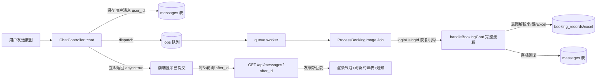

## 产品概述
聊天页的「截图约课」消息改为异步处理：用户发送图片后立即收到"已提交后台处理"的回复，豆包在后台队列中完成截图识别与约课操作，完成后通过页面气泡 + 浏览器通知告知用户。文字聊天保持同步，图片生成页（/generate）保持现状不动。

## 核心功能
- 截图约课（图片消息 / 图片+文字）提交后立即返回，不再长时间阻塞等待豆包
- 后台队列异步执行：截图识别 → 约课意图处理（约课/改课/取消/查询）→ Excel 更新 → 回复存档
- 完成通知：页面轮询检测到新回复后自动渲染气泡、刷新约课表，并触发浏览器通知
- 异步期间用户可继续发送文字消息，互不阻塞
- 失败兜底：豆包出错时后台仍存档一条明确的错误回复并通知用户，不会静默丢失
- 文字消息与图生图功能保持原有同步行为，不做任何改动


## 技术栈
- 沿用现有 Laravel 11 + MySQL + Blade + 原生 JS 架构，不引入新依赖
- 队列：数据库队列（`.env` 已配置 `QUEUE_CONNECTION=database`，`jobs`/`job_batches`/`failed_jobs` 表迁移已存在，可直接使用）

## 实施方案
### 核心思路
图片消息在 `ChatController::chat()` 中仅做「保存用户消息 + 派发队列任务」，立即返回 `{reply: "收到！图片已提交后台处理，完成后会通知你", async: true}`。`ProcessBookingImage` Job 在 worker 中恢复用户登录态后复用现有 `handleBookingChat()` 完整业务流程（意图解析、约课操作、Excel 生成、回复存档），完成后前端通过增量轮询 `/api/messages?after_id=` 获取新回复并通知用户。

### 关键技术决策
1. **恢复机构上下文（关键难点）**：`Message`/`BookingRecord` 模型的全局作用域与 `organization_code` 自动填充都依赖 `auth('web')->user()`，而队列 worker 无登录态。方案：`messages` 表新增 `user_id` 列，`saveUserMessage()` 写入当前用户 id；Job 内 `Auth::guard('web')->loginUsingId($message->user_id)` 恢复上下文，`finally` 中 `logout()` 防止 worker 常驻进程残留登录态。
2. **Job 复用控制器业务**：`handleBookingChat()` 由 private 改 public，Job 通过容器 `app(ChatController::class)` 调用，`doCreate/doUpdate/doDelete/doComplete/handleQuery` 等业务逻辑零改动，最小化 blast radius。
3. **增量轮询 + 去重**：`history()` 增加 `after_id` 参数（`id > after_id` 升序返回）；前端维护已渲染消息 id 集合，轮询结果过滤去重，避免与同步文字消息重复渲染。
4. **失败不重试**：豆包超时/报错重试无意义，Job 内 try/catch 全包并存档 assistant 错误消息（沿用现有 `ChatController::chat()` 的异常存档模式），失败任务落入 `failed_jobs` 便于排查。
5. **性能**：轮询每 5 秒一次、单行索引查询，负载可忽略；10 分钟未完成自动停止并提示，避免无限轮询。

### 执行细节
- `chat()` 异步分支：仅在「带图且非图生图（无 `feature=image` 且无 style a/b）」时走异步，与现有分流条件保持一致；`set_time_limit(0)` 对同步分支保留，异步分支无需长超时
- 前端通知：轮询发现新消息时 `toast()` + 页面可见时直接渲染，`document.hidden` 时用 Notification API（首次请求授权，被拒则静默降级为 toast）
- 图生图 / 生成页 / 文字聊天完全不动，回归风险集中在异步分支

## 架构设计


## 目录结构
```
database/migrations/xxxx_add_user_id_to_messages_table.php   # [NEW] messages 表加 user_id（nullable + index），兼容历史数据
app/Jobs/ProcessBookingImage.php                             # [NEW] 异步处理 Job：恢复登录态 → 调用 handleBookingChat → 异常存档
app/Http/Controllers/ChatController.php                      # [MODIFY] chat() 图片异步分支、handleBookingChat 改 public、saveUserMessage 写 user_id、history 支持 after_id
public/js/chat.js                                            # [MODIFY] send() 异步分支、增量轮询、消息去重、通知
tests/Feature/AsyncImageBookingTest.php                      # [NEW] 队列派发与 after_id 增量测试
```

## 关键代码结构
```php
// app/Jobs/ProcessBookingImage.php（核心契约）
class ProcessBookingImage implements ShouldQueue
{
    public int $tries = 1; // 豆包失败重试无意义，落 failed_jobs 排查

    public function __construct(public readonly int $messageId) {}

    public function handle(): void
    {
        $message = Message::find($this->messageId); // 未登录时全局作用域不生效，可查到
        if (! $message || ! $message->user_id) return;

        Auth::guard('web')->loginUsingId($message->user_id); // 恢复机构上下文
        try {
            app(ChatController::class)->handleBookingChat($message, true);
        } catch (\Throwable $e) {
            // 沿用现有模式：存档 assistant 错误消息，保证用户可见
        } finally {
            Auth::guard('web')->logout(); // 防 worker 残留登录态
        }
    }
}
```

```php
// ChatController::chat 异步分支（示意）
if ($hasImage && ! ($feature === 'image' || in_array($style, ['a', 'b']))) {
    ProcessBookingImage::dispatch($userMessage->id);
    return response()->json([
        'reply' => '收到！图片已提交后台处理，完成后会通知你。',
        'async' => true,
    ]);
}
```

```php
// history() 增量参数（示意）
$query = Message::orderBy('id', 'asc');
if ($afterId = (int) $request->input('after_id')) {
    $query->where('id', '>', $afterId);
}
$messages = $query->limit(min((int) $request->input('limit', 50), 200))->get();
```

## 部署注意事项
- **必须启动队列 worker**（否则图片消息永远不处理）：宝塔计划任务每 1 分钟执行 `php artisan queue:work --once --stop-when-empty`，或 supervisor 守护 `php artisan queue:work`
- 部署顺序：提交推送 → `php artisan migrate` → `php artisan optimize:clear`


# Agent Extensions
无适用扩展：本任务为 Laravel 队列改造，现有扩展（文档/PPT/浏览器自动化等）与本需求无直接关联，不引入。
